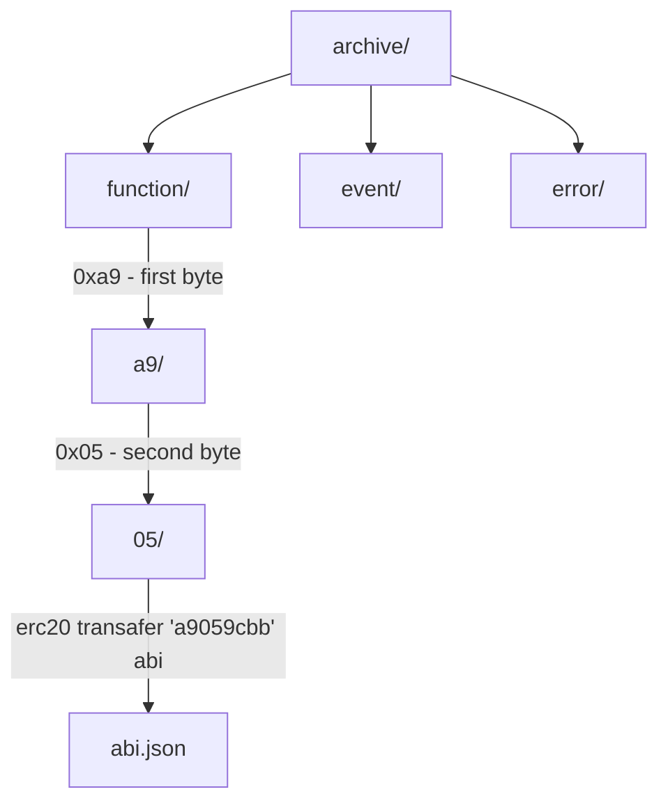

# ABI Archive Trie
ABI Archive is a project that stores ABI files on GitHub and serves them through `githubusercontent URLs`. This allows applications to fetch the required ABI via simple HTTP requests. As a result, ABI data can be widely retrieved across different projects.

## Trie-Based Directory Layout


The project organizes ABI files using a **trie-based directory layout**.
- By using the first 2 bytes of the function selector as a two-level depth structure, it helps to minimize ABI collisions.
- ABI entries are also separated by **error, event, and function categories**, further reducing the chance of conflicts.
- This structure also reduces the size of response data, making ABI retrieval more efficient.

#### Use Cases & References
- [**choi.eth Labs**](https://choiethlabs.netlify.app/): EVM Transaction Analyzer, Parse Calldata/Error data

</br>

## Example
### Request HTTP
```shell
$ curl https://raw.githubusercontent.com/imelon2/abi-archive-trie/refs/heads/main/archive/function/a9/05/abi.json
[
  {
    "inputs": [
      {
        "internalType": "address",
        "name": "to",
        "type": "address"
      },
      {
        "internalType": "uint256",
        "name": "amount",
        "type": "uint256"
      }
    ],
    "name": "transfer",
    "outputs": [
      {
        "internalType": "bool",
        "name": "",
        "type": "bool"
      }
    ],
    "stateMutability": "nonpayable",
    "type": "function"
  },
]

```
### Using Axios
```typescript
import axios from "axios"

const request = await axios.get("https://raw.githubusercontent.com/imelon2/abi-archive-trie/refs/heads/main/archive/function/a9/05/abi.json")
console.log(request.data)

[
  {
    "inputs": [
      {
        "internalType": "address",
        "name": "to",
        "type": "address"
      },
      {
        "internalType": "uint256",
        "name": "amount",
        "type": "uint256"
      }
    ],
    "name": "transfer",
    "outputs": [
      {
        "internalType": "bool",
        "name": "",
        "type": "bool"
      }
    ],
    "stateMutability": "nonpayable",
    "type": "function"
  },
]
```

## How to generate ABI

Reads all ABI sources (`abi-root.yml` + `abi-json/`) and writes the results into the `archive/` directory using the trie-based layout.
Each entry is classified as `function`, `error`, or `event`, and duplicates are automatically skipped.

```shell
pnpm run gen

Found 1104 files (864 from abi-root.yml, 240 from abi-json/)

────────────────────────────────────────
  files processed : 1104
  functions        : 602 saved, 8744 skipped (9346 total)
  errors           : 182 saved, 2208 skipped (2390 total)
  events           : 106 saved, 2126 skipped (2232 total)
────────────────────────────────────────
  total saved      : 890
  done in 1.14s
```

## How to add New ABI

### Get ABI JSON from node_modules version

Use this method when the target contract is published as an npm package.

**1. Install the package as a devDependency**

If the package supports multiple versions, use an npm alias to avoid conflicts:
```shell
pnpm add -D @openzeppelin/contracts-v5@npm:@openzeppelin/contracts@5
```

**2. Add the build artifact path to `abi-root.yml`**

Add the path to the compiled JSON files (e.g. Hardhat/Foundry build output) under `root`:
```yaml
root:
  - "node_modules/@openzeppelin/contracts-v5/build/contracts"
```

The path is treated as a glob base — `+([a-zA-Z0-9_]).json` is automatically appended to match ABI files.

**3. Run the generator**
```shell
pnpm run gen
```

---

### Get ABI JSON from `./abi-json` directory

Use this method when the contract is not available as an npm package (e.g. closed-source, custom, or external protocols).

**1. Place the ABI JSON file under `./abi-json/`**

Organize files by protocol name. The JSON file must have an `abi` field at the top level:
```
abi-json/
└── ProtocolName/
    └── ContractName.json   # must contain { "abi": [...] }
```

For contracts compiled with Hardhat or Foundry, the artifact JSON already includes the `abi` field and can be used directly.

**2. Run the generator**
```shell
pnpm run gen
```
